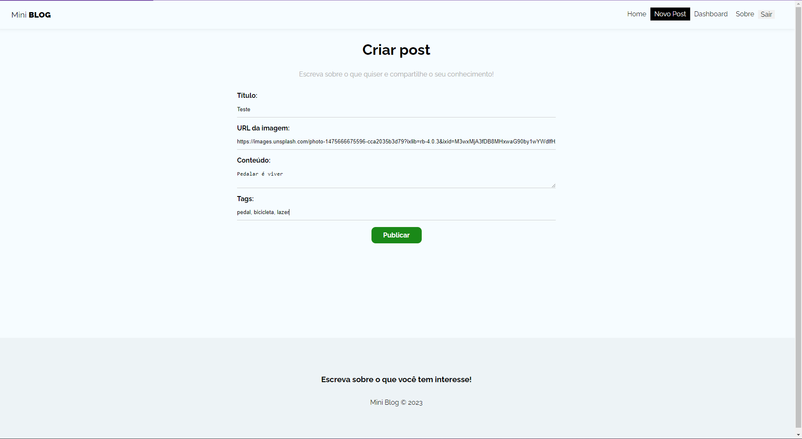
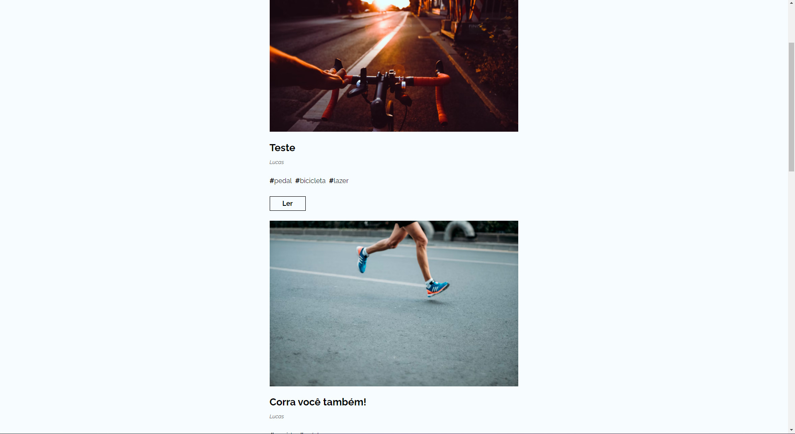
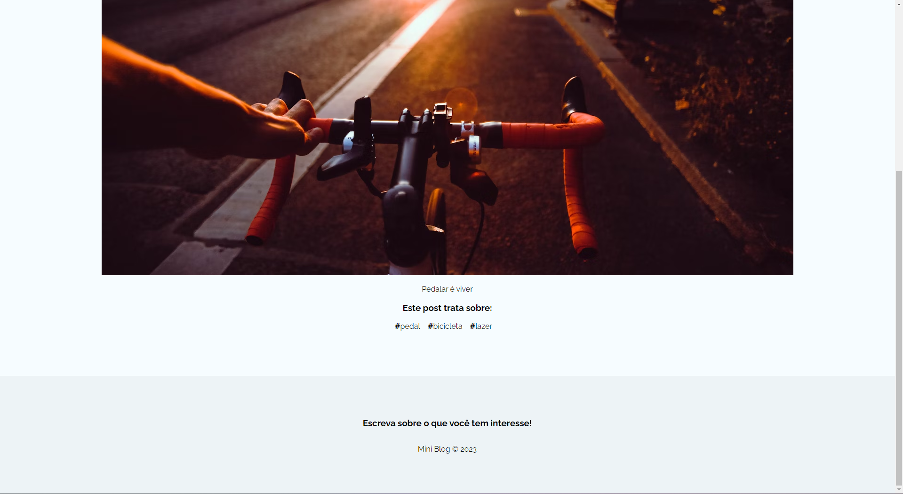

<h1 align="center">MiniBlog</h1>

## :memo: Description
This is a React-developed blog app that allows users to create an account, log in, and create posts with titles, image URLs, descriptions, and tags. Users can also edit their posts, view posts from other users, and delete their own posts. The app includes authentication to determine if a user is logged in or not, and it incorporates necessary redirections when needed.

## :framed_picture: Photo
<div display="flex">
    
    
    
    
    
    
    

</div>

## :wrench: Technologies Used


## :rocket: Getting Started

### Prerequisites
- Node.js and npm should be installed on your machine.

### Installation

1. Clone the repository:
```
git clone https://github.com/lucasbf7/Miniblog
```
2. Navigate to project file:
```
cd Miniblog
```
3. Install dependencies:
```
npm install
```

### Running the Project
1. Start the application:
```
npm run dev
```
2. Open the browser on the designated URL to view the app.
